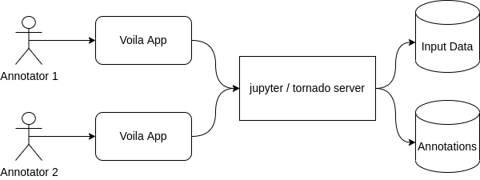

#################
Design Decisions
#################

Jupyter Notebook all the way down
=========

Jupyter Notebook is used by many researcher relaying on open source software 
to create and document their work. Ipyannotator not only runs directly in 
Jupyter Notebook but is also developed as a collection of notebooks. This 
collection constitues a library, user documentation, and executable tutorials. 
This workflow is enabled by the innovative fastai library that turns 
Jupyter Notebook into a literate programming environment.

For the development of the user interface (UI) the Ipywidget library was used 
to build a graphical user interface (GUI) in Jupyter Notebook. 
Furthermore, the voila library, which uses Jupyter Notebook as a web-app, was 
also incorporated in the Ipyannotator project to create the GUI for an easy 
access to a web application.

Architecture
=========

Ipyannotator's architecture consists of three main systems components that 
comprise the user interface (UI), the server, and the data storage. These 
components are targeted at two different user types. A non-code architecture 
is included for non-technical annotators. The setup for a wide range of 
technically experienced annotators target users typically involved in research 
projects, e.g. data scientists, domain experts, and software developer.

.. image:: img/technical-user-architecture.png

For the technical user multiple tutorials are provided, demonstrating 
Ipyannotator's utilization. The tutorials make it easier for new users 
get started and adapt the notebooks to their tasks. They also 
demonstrate annotation workflow and different features.

Layers
=========

The layering design leads to loosely coupled systems, isolating 
responsibilities and allows to easier implement changes. Ipyannotator is 
separated into multiple layers to provide an architecture that allows the 
annotator to easier add extensions. The library uses four layers: view, 
controller, storage, and state. Each layer can be rewritten, extended and 
customized.

- The *View* layer is responsible for rendering the visualizations. Ipyannotator uses ipycanvas and ipywidgets to structure and mount the visualization layer. Additionally, internal components such as the navigation menue were developed which helps the users to navigate through the images that need to be annotated.
- The *Storage* layer is the layer that receives the data and stores it. Ipyannotator uses different types of storage formats like .txt and .SQLite.
- The *Controller* layer acts as a mediator between state, storage and view. This layer tells when the information from the state will be stored.
- *Model/State (in memory)* is the central function of the Ipyannotator layer structure. It is assigned to centralize the data and ensures the syncronization across the applications. If something changes in the Model/State layer, the information is passed on to other layers, ensuring  synchronization of information.

.. image:: img/layer-communication.png

In the present state, Ipyannotator uses SQLite and JSON files as storage 
formats. Due to the project setup, the storage layer can be customized by 
other users to implement different storage formats. 

The Ipyannotator comprises four annotation types: bounding box annotator, 
video annotator, capture annotator, and explore annotator. 
All types can be combined in the data analysis. 

- Bounding box annotator: Allow users to investigate and produce annotations on images, the annotations are limited to the bounding boxes format.
- Video annotator: Designed to work with multiple frames of a video, this annotator allow users to inspect objects over the frames, visualizing the object's trajectories and improving it. The annotations it's also limited to the bounding box format.
- Capture annotator: Enables users to navigate across a grid of images or labels and select multiple options. This annotator can be used in Ipyannotator's improve step to check if image classification is correct, for example.
- Explore annotator: Aims to be a quickly, easy configuration annotator, it can be used to navigate across images without worring about the Output in the Annotator API.

The bounding box annotator tool, displayed in the image above, contains three 
rectangluar annotations exemplifying how the user can draw on the canvas. 
The navigation menu at the bottom of the image allows users to explore all 
images. The navigation menu is common to all annotator tools. After an 
annotation is drawn, the tool allows the association with a semantic label 
located at the dropdown menue on the right. Additionally to the labeling, 
the annotator tool also permits to apply change to the coordinates of the 
drawing, enabling users to improve annotations.

It has to be emphasized that the entire interactive UI has been implemented 
using Python code only and without additional complex build steps. This allows 
every user with Python scripting experience to customize the annotation 
interface for domain specific requirements.
