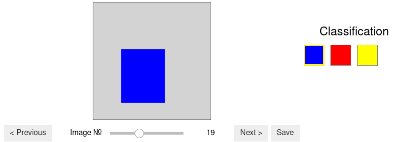
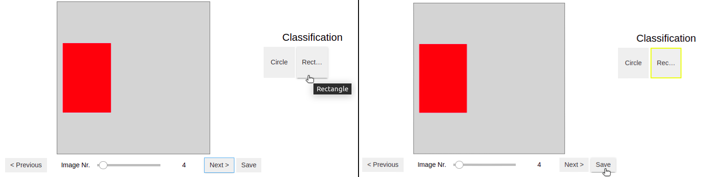
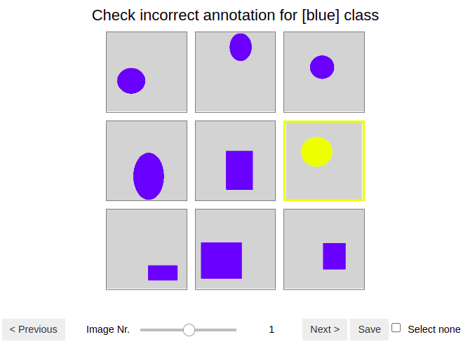
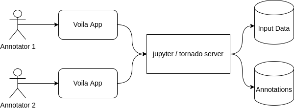
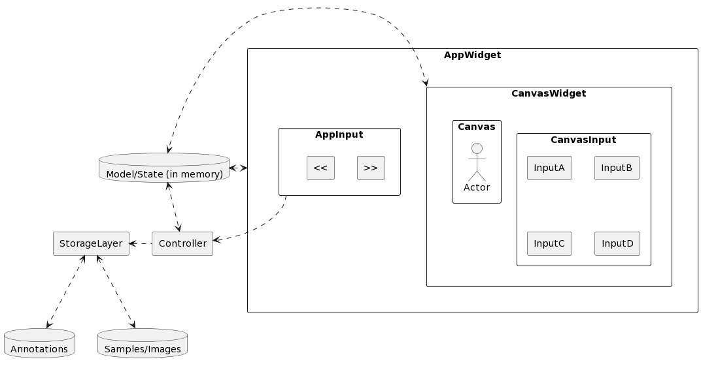
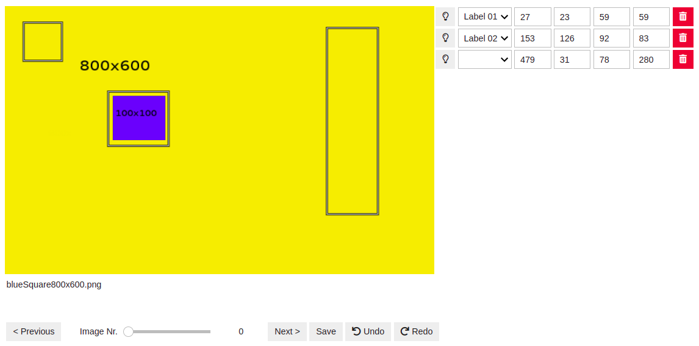

# Summary
Annotation is a task that associates semantic tags to a digital representation (image, video, text, and others). This process is important for supervised machine learning (ML) approaches, since the model learns and successively improves from data examples in form of input-output-pairs.

The variety of digital representations makes it difficult to develop a tool that is flexible and meets all requirements for machine learning applications in different projects. Ipyannotator is an open-source tool that allows manual annotation on multiple data formats, enabling researchers/users to explore, create and improve their datasets without leaving their own development environment, and empowering them to extend and customize the annotation process.

# Statement of need
Many breakthroughs in machine learning (ML) applications such as image classification, text understanding, and recommender systems belong to the class of supervised machine learning. These ML methods often require an extensive basis of annotated data from which the model learns. The amount and quality of the annotated data is essential to generate a model which yields accurate prediction [@wong2015smartannotator].

The variety of annotation taks, data formats, and the respective visualization of data is enormous. Dealing with multiple domains of supervised ML, the large variety of applications is a challenging task considering that the tooling is potentially not flexible enough which imposes limitations to the user.

Ipyannotator is a library developed to provide a solution to this problem. Ipyannotator can be used to visualize, create, and improve datasets, providing a flexible solution that can be extended and customized by the user within the development environment Jupyter.

Jupyter is one of the most popular tools for data science [@wang2019how] and is currently used by more than 7850000 public repositories on GitHub [@parente2022nbestimate]. Ipyannotator is a tool developed to be used on Jupyter Notebook, allowing researchers and developers to integrate the library into their ML projects quickly and easily. The solution, however, is not limited to research and developement teams. Since the Ipyannotator runs also on a web server, it can by used for annotation purposes by any user.

[@lahtinen2021brima] developed an annotator as a browser plugin, [@dutta2019via] built an annotator as a program that runs on the browser, and [@bernal2019gtcreator] developed a desktop application for domain-specific medical image annotation. The previous annotation tools are restricted to fixed data types and a specific type of annotation. Since the Ipyannotator can be integrated via Jupyter Notebook, additional features and general customization can easily be performed by the developers, creating an "infinitely hackable annotation framework".

# A simple but flexible API to define annotation tasks
Ipyannotator provides a simple API (application programming interface) which is based on three steps describing general tasks in the data annotation process. These are denoted as the explore, create, and improve phase.

These three steps in conjuction with domain-specific annotation types, define the inputs and outputs of the annotation process, providing a very flexible and extendable API to set up annotation tasks.

The following code examples illustrate the main actions around which the Ipyannotator API is built. Please keep in mind that Ipyannotator aims to be flexible enought so that these generic aspects can be extented to much complexer and domain-specific tasks and interfaces. As an exemplary application, a standard image classification task, is used in the following.

To set up Ipyannotator in Jupyter Notebook the library has to be imported with three main components: the pair of input/output data, the settings structure, and the generic annotator module. The following example uses the 
```python 
InputImage/OutputImageLabel
```
associated with the image classification task. It imports the settings pointing to a folder called 'data' and configures the annotator module with the entries. Once the annotator module is configured it can be used to call the explore, create and improve steps.

```python
from pathlib import Path
from ipyannotator.base import Settings
from ipyannotator.annotator import Annotator
from ipyannotator.mltypes import InputImage, OutputImageLabel

input = InputImage(image_dir='images', image_width=200, image_height=200)
output = OutputImageLabel(label_dir='labels', label_width=30, label_height=30)
settings = Settings(project_path=Path('data'))

annotator = Annotator(input, output, settings)
```

## Explore
The explore step provides the ability to visualize and navigate through images and datasets. \autoref{fig:image-classification-explore} displays an example of an image classification task using one of Ipyannotator's inbuilt artificial demonstration datasets.
The dataset consists of images showing simple shapes in different colors. The annotation task is to assign to each image the color which is closest to the provided labels.

The explore step is started by the command:

```python
annotator.explore()
```
{ width=60% }

## Create
In the create step new annotation datasets can be created by the user. \autoref{fig:image-classification-create} presents an example of an image classfication task, allowing the user to manually select multiple options and save the results in the dataset.

The create step is started by the following instruction:

```python
annotator.create()
```



## Improve
The improve step enables the user to refine datasets and, thereby, improve the annotation quality. \autoref{fig:image-classification-improve} displays the improve usage, allowing users to iterate over every class and identify incorrect results.

Inspecting large batches of pre-annotated data allows to very quickly improve the quality of datasets that were generated by an insufficient ML model. It also allows a domain expert to verify and improve the annotation work of less specialized annotators.

```python
annotator.improve()
```

{ width=60% }

# Key Design Decisions
## Jupyter Notebook all the way down
Jupyter Notebook is used by many researcher relaying on open source software to create and document their work.
Ipyannotator not only runs directly in Jupyter Notebook but is also developed as a collection of notebooks. This collection
constitues a library, user documentation, and executable tutorials. This workflow is enabled by the innovative fastai library [@nbdev2022]
that turns Jupyter Notebook into a literate programming environment.

For the development of the user interface (UI) the Ipywidget library [@ipywidgets2022] was used to build a graphical user interface (GUI) in Jupyter Notebook. Furthermore, the voila library [@voila2022], which uses Jupyter Notebook as a web-app, was also incorporated in the Ipayannotator project to create the GUI for an easy to access web application.

## Architecture
Ipyannotator's architecture consists of three main systems components that comprise the user interface (UI), the server, and the data storage. These components are targeted at two different user types. A non-code architecture, which is schematically illustrated in \autoref{fig:non-technical-annotator}, is included for non-technical annotators. The setup for a wide range of technically experienced annotators, schematically shown in \autoref{fig:technical-user-architecture}, target users typically involved in research projects, e.g. data scientists, domain experts, and software developer.

{ width=60% }

{ width=52% }

For the technical user multiple tutorials are provided, demonstrating Ipyannotator's utilization. The tutorials make it easier for new users get started and adapt the notebooks to their tasks. They also demonstrate annotation workflow and different features.

## Layers
The layering design leads to loosely coupled systems, isolating responsibilities and allows to easier implement changes [@gamma1995design]. Ipyannotator is separated into multiple layers to provide an architecture that allows the annotator to easier add extensions. The library uses four layers: view, controller, storage, and state. Each layer can be rewritten, extended and customized.

- The *View* layer is responsible for rendering the visualizations. Ipyannotator uses ipycanvas and ipywidgets to structure and mount the visualization layer. Additionally, internal components such as the navigation menue were developed which helps the users to navigate through the images that need to be annotated.

- The *Storage* layer is the layer that receives the data and stores it. Ipyannotator uses different types of storage formats like .txt and .SQLite.

- The *Controller* layer acts as a mediator between state, storage and view. This layer tells when the information from the state will be stored.

- *Model/State (in memory)* is the central function of the Ipyannotator layer structure. It is assigned to centralize the data and ensures the syncronization across the applications. If something changes in the Model/State layer, the information is passed on to other layers, ensuring  synchronization of information.

\autoref{fig:layer-communication} exemplifies how the layers are structured and how the communication path is set up.



In the present state, Ipyannotator uses SQLite and JSON files as storage formats. Due to the project setup, the storage layer can be customized by other users to implement different storage formats. 

The Ipyannotator comprises four annotation types: bounding box annotator, video annotator, capture annotator, and explore annotator. All types can be combined in the data analysis. 

- Bounding box annotator: Allow users to investigate and produce annotations on images, the annotations are limited to the bounding boxes format.
- Video annotator: Designed to work with multiple frames of a video, this annotator allow users to inspect objects over the frames, visualizing the object's trajectories and improving it. The annotations it's also limited to the bounding box format.
- Capture annotator: Enables users to navigate across a grid of images or labels and select multiple options. This annotator can be used in Ipyannotator's improve step to check if image classification is correct, for example.
- Explore annotator: Aims to be a quickly, easy configuration annotator, it can be used to navigate across images without worring about the Output in the Annotator API.

\autoref{fig:bounding-box-annotator} displays the bounding box annotator tool.



The bounding box annotator tool displayed in \autoref{fig:bounding-box-annotator} contains three rectangluar annotations exemplifying how the user can draw on the canvas. The navigation menu at the bottom of the image allows users to explore all images. The navigation menue is common to all annotator tools. After an annotation is drawn, the tool allows the association with a semantic label located at the dropdown menue on the right. Additionally to the labeling, the annotator tool also permits to apply change to the coordinates of the drawing, enabling users to improve annotations.

It has to be emphasized that the entire interactive UI has been implemented using Python code only and without additional complex build steps. This allows every user with Python scripting experience to customize the annotation interface for domain specific requirements.

# Usage

Currently, Ipyannotator is used for supervised ML projects by the devloper Palaimon GmbH. Multiple tutorials and use cases have been tested and published to improve and validate the usage of Ipyannotator on other real world projects.

# Acknowledgements

The authors acknowledge the financial support by the Federal Ministry for Digital and Transport of Germany under the program mFUND for the project OS-VAT (project number 19F2160A).

# References
